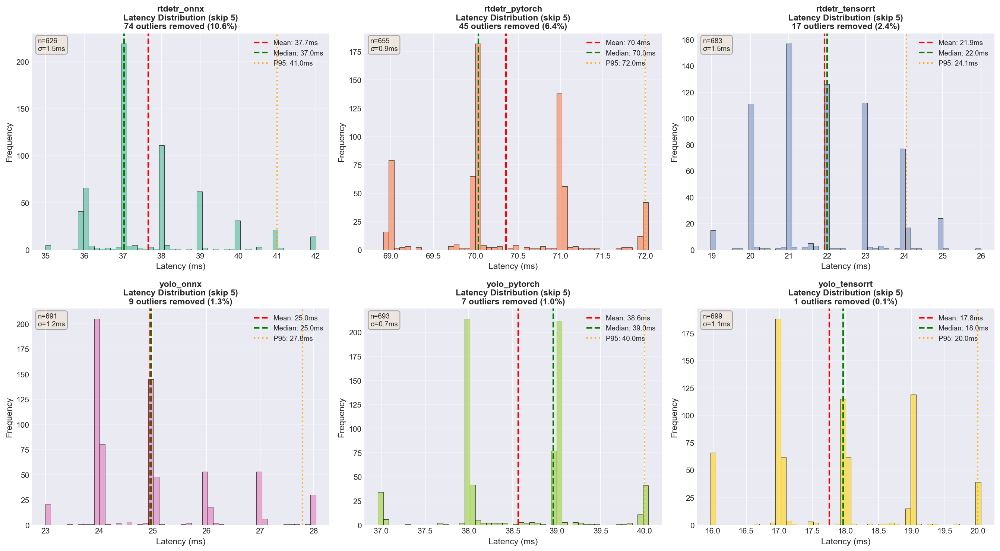
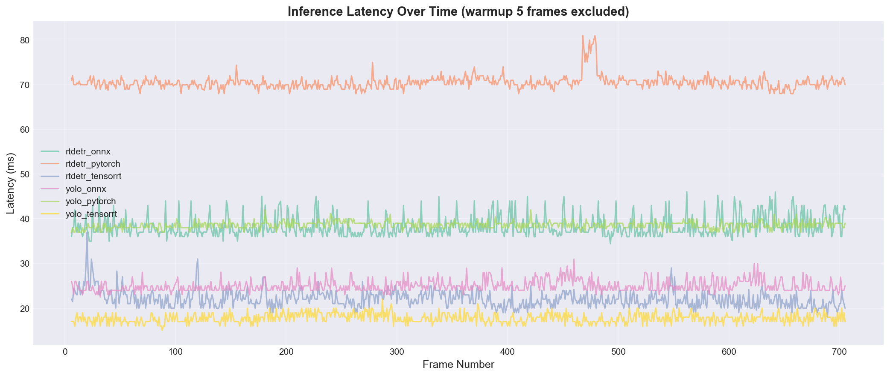
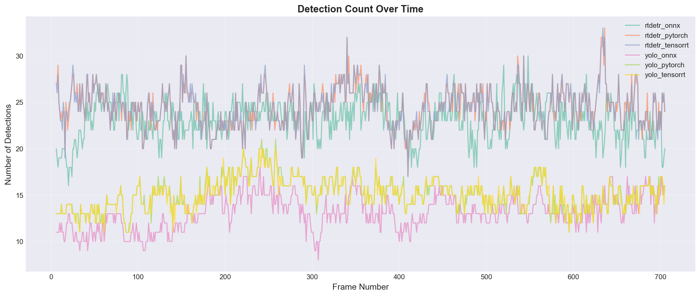
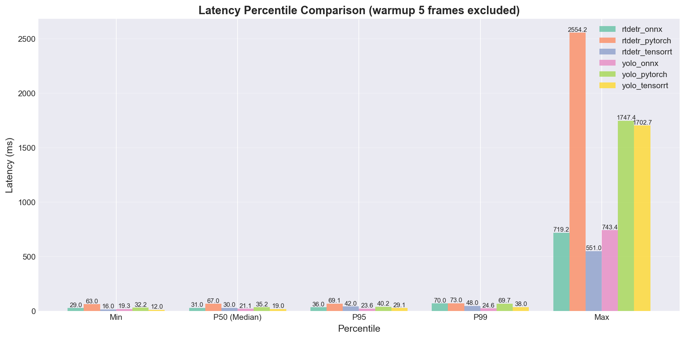

# 🔬 YOLO vs RT-DETR: Comprehensive Benchmark
### Real-time Object Detection Performance Analysis on NVIDIA GPU
---

## 📊 Research Overview

This project presents a **comprehensive empirical study** comparing two state-of-the-art object detection architectures:
- **YOLOv8** (You Only Look Once v8) - anchor-free, single-stage detector
- **RT-DETR** (Real-Time Detection Transformer) - transformer-based detector

I benchmark these models across **three inference backends** (PyTorch, ONNX Runtime, TensorRT) to evaluate real-world deployment performance on consumer-grade NVIDIA GPUs.

### 🎯 Research Questions

1. **How do YOLO and RT-DETR compare in terms of latency and throughput?**
2. **What is the performance impact of different inference backends?**
3. **Which architecture provides the best speed-accuracy trade-off for production deployment?**

---

## 🚀 Key Findings

### Performance Summary

| Model | Backend | Avg Latency (ms) | Avg FPS | P95 Latency (ms) | Detections/Frame |
|-------|---------|------------------|---------|------------------|------------------|
| **YOLO** | ONNX Runtime | **22.31** | **44.82** | 23.65 | 13.09 |
| **YOLO** | TensorRT | 23.61 | 42.35 | 29.11 | 15.12 |
| **YOLO** | PyTorch | 38.81 | 25.77 | 40.17 | 15.12 |
| **RT-DETR** | TensorRT | **29.40** | **34.01** | 42.00 | 24.47 |
| **RT-DETR** | ONNX Runtime | 33.72 | 29.65 | 36.00 | 23.05 |
| **RT-DETR** | PyTorch | 70.32 | 14.22 | 69.08 | 24.48 |

### 🔑 Main Insights

1. **YOLO + ONNX Runtime** achieves the **fastest inference** (22.31 ms, 44.82 FPS)
2. **RT-DETR detects ~60% more objects** per frame (24.47 vs 15.12 avg detections)
3. **Backend optimization matters**: ONNX provides **2.5x speedup** vs PyTorch for RT-DETR
4. **TensorRT delivers consistent performance** with lower P95 latency variance

---

## 🏗️ Architecture Comparison

### YOLOv8 (Anchor-Free CNN)


- **Strengths**: Ultra-low latency, simple architecture, mature ecosystem
- **Trade-offs**: Fewer detections per frame, may miss small/occluded objects

### RT-DETR (Transformer-Based)


- **Strengths**: Higher recall, better detection density, transformer attention
- **Trade-offs**: Higher computational cost, more memory intensive

---

## 📈 Detailed Results

### Latency Distribution



*Distribution shows YOLO's tighter latency variance vs RT-DETR*

### Throughput Over Time



*Time-series analysis reveals stable frame-to-frame performance with smal jitter*

### FPS Over Time


*ONNX backends show the most consistent throughput across both architectures*

### Detection Count Over Time



*RT-DETR maintains higher and more consistent detection counts in crowded scenes*

### Percentile Comparison


*Detailed percentile analysis showing P50, P95, and P99 latencies*

---

## 🛠️ Experimental Setup

### Hardware Configuration
- **GPU**: NVIDIA GeForce RTX 5080
- **CPU**: Intel Xeon E5-2680 v4 @ 2.4GHz
- **RAM**: 32GB RAM DDR4
- **Driver**: CUDA 13.1, cuDNN 8.9.6

### Software Stack
- **Framework**: PyTorch 2.11+cu130 (dev), Ultralytics 8.4.5
- **Backends**: 
  - PyTorch (native JIT)
  - ONNX Runtime 1.24.0 ([custom for blackwell support](https://huggingface.co/ussoewwin/onnxruntime-gpu-1.24.0))(CUDAExecutionProvider)
  - TensorRT 10.9.0.34
- **OS**: Windows 10 x64
- **Python**: 3.12

### Dataset & Methodology
- **Video**: 705 frames @ 1080p (crowd surveillance scenario)
- **Metrics**: Frame-level latency, FPS, detection count
- **Warm-up**: First 5 frames excluded from metrics
- **Precision**: FP32 inference

---

## 📂 Project Structure

```
crowd-detection/
├── data/                       # Input videos
│   └── test_video.mp4
├── src/
│   ├── detectors/              # Model implementations
│   │   ├── yolo_detector.py
│   │   ├── rtdetr_detector.py
│   │   ├── onnx_detector.py
│   │   └── trt_detector.py
│   ├── utils/
│   │   ├── metrics.py          # Performance tracking
│   │   └── video_processor.py
│   └── export/
│       └── model_exporter.py   # ONNX/TRT conversion
├── metrics/                    # JSON metrics (6 runs)
│   ├── yolo_pytorch_metrics.json
│   ├── yolo_onnx_metrics.json
│   ├── yolo_tensorrt_metrics.json
│   ├── rtdetr_pytorch_metrics.json
│   ├── rtdetr_onnx_metrics.json
│   └── rtdetr_tensorrt_metrics.json
├── plots/
│   ├── summary_comparison.png
│   ├── latency_over_time.png
│   ├── fps_over_time.png
│   ├── latency_distribution.png
│   ├── percentile_comparison.png
│   └── detections_over_time.png
├── output/                     # Processed videos
├── main.py                     # CLI entry point
├── visualize_metrics.py        # Plotting utilities
├── config.yaml                 # Model configurations
├── requirements.txt
├── Dockerfile
└── docker-compose.yml
```

---

## 🚀 Quick Start

### Local Installation

```bash
# Clone repository
git clone https://github.com/Shazy021/yolo-vs-rtdetr-benchmark.git

cd yolo-vs-rtdetr-benchmark

# Create virtual environment
python -m venv .venv
source .venv/bin/activate  # Windows: .venv\Scripts\activate

# Install dependencies
pip install -r requirements.txt

# Run benchmark
python main.py --source data/crowd.mp4 --model yolo --backend onnx --output outputs/yolo_onnx.mp4 --save-metrics metrics/yolo_onnx.json
```

### Docker Deployment

```bash
docker-compose build crowd-detection

# Run ONNX benchmark
docker-compose run --rm crowd-detection \
    --source data/crowd.mp4 \
    --model yolo \
    --backend onnx \
    --output outputs/yolo_onnx.mp4 \
    --save-metrics metrics/yolo_onnx.json

# Generate visualizations
python visualize_metrics.py --glob "metrics/*.json" --skip-warmup 5

```
## 💻 CLI Usage

### Basic Usage

```bash
python main.py --source VIDEO --model MODEL --backend BACKEND [OPTIONS]
```

### Arguments

| Flag | Type | Default | Description |
|------|------|---------|-------------|
| `--source` | `str` | **required** | Path to input video file |
| `--output` | `str` | `output/result.mp4` | Path to output video |
| `--config` | `str` | `config.yaml` | Path to config file |
| `--model` | `yolo\|rtdetr` | from config | Model architecture |
| `--backend` | `pytorch\|onnx\|tensorrt` | from config | Inference backend |
| `--weights` | `str` | from config | Path to model weights |
| `--conf` | `float` | from config | Confidence threshold |
| `--nms` | `float` | from config | NMS threshold |
| `--max-frames` | `int` | all | Maximum frames to process |
| `--show` | `flag` | - | Show preview window |
| `--no-display-info` | `flag` | - | Hide FPS overlay |
| `--save-metrics` | `str` | - | Save metrics to JSON |
| `--no-metrics` | `flag` | - | Disable metrics tracking |
| `--comparison-mode` | `fair\|adaptive` | from config | Input size strategy |
### Examples


---

## 📊 Reproducing the Benchmark

### Step 1: Run All Benchmarks

```bash
# YOLO variants
python main.py --source data/crowd.mp4 --model yolo --backend pytorch --save-metrics metrics/yolo_pytorch.json
python main.py --source data/crowd.mp4 --model yolo --backend onnx --save-metrics metrics/yolo_onnx.json
python main.py --source data/crowd.mp4 --model yolo --backend tensorrt --save-metrics metrics/yolo_tensorrt.json

# RT-DETR variants
python main.py --source data/crowd.mp4 --model rtdetr --backend pytorch --save-metrics metrics/rtdetr_pytorch.json
python main.py --source data/crowd.mp4 --model rtdetr --backend onnx --save-metrics metrics/rtdetr_onnx.json
python main.py --source data/crowd.mp4 --model rtdetr --backend tensorrt --save-metrics metrics/rtdetr_tensorrt.json
```

### Step 2: Generate Visualizations

```bash
python visualize_metrics.py \
    --glob "metrics/*.json" \
    --skip-warmup 5 \
    --output plots/
```

---

## 🎥 Demo Results

### YOLO ONNX Runtime

| Config | Latency | FPS | Demo | Description |
|--------|---------|-----|------|-------------|
| **YOLO ONNX Demo** | 22.31ms | 44.82 |  | Lightweight detection |
| **YOLO TensorRT** | 23.61ms | 42.35 |  | Optimized GPU kernels |
| **YOLO PyTorch** | 38.81ms | 25.77 |  | Native framework |
| **RT-DETR ONNX** | 33.72ms | 29.65 |  | Higher detection density |
| **RT-DETR TensorRT** | 29.4ms | 34.01 |  | Best RT-DETR performance |
| **RT-DETR PyTorch** | 70.32ms | 14.22 |  | Maximum detections |

---

## 🔍 Analysis & Discussion

### Backend Optimization Impact

**ONNX Runtime Speedup:**
- YOLO: **1.74x faster** than PyTorch (38.81ms → 22.31ms)
- RT-DETR: **2.09x faster** than PyTorch (70.32ms → 33.72ms)

**TensorRT Performance:**
- YOLO: Comparable to ONNX, better P95 stability
- RT-DETR: **1.64x faster** than PyTorch, **12% faster** than ONNX

### Detection Quality Trade-offs

RT-DETR achieves **62% more detections** than YOLO (24.47 vs 15.12 avg):
- Better recall for crowded scenes
- Transformer attention captures spatial relationships
- Cost: ~31% higher latency (29.40ms vs 22.31ms with best backends)

### Production Deployment Recommendations

| Use Case | Recommended Configuration | Rationale |
|----------|--------------------------|-----------|
| **Real-time edge devices** | YOLO + ONNX | Lowest latency (22ms), minimal memory |
| **Cloud-based API** | RT-DETR + TensorRT | Balanced speed (29ms) + high recall |
| **High-accuracy surveillance** | RT-DETR + ONNX | Best detection density, deployable |
| **Embedded systems** | YOLO + TensorRT | Optimized GPU utilization, stable |


---

<p align="center">
  <sub>for computer vision community</sub>
</p>