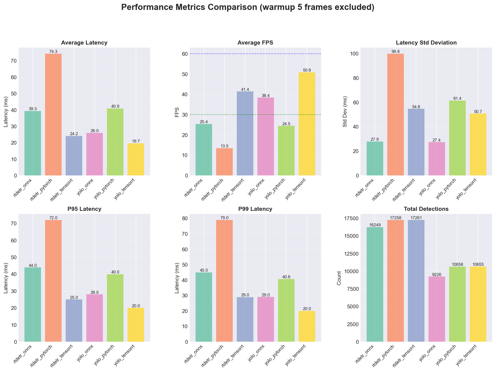
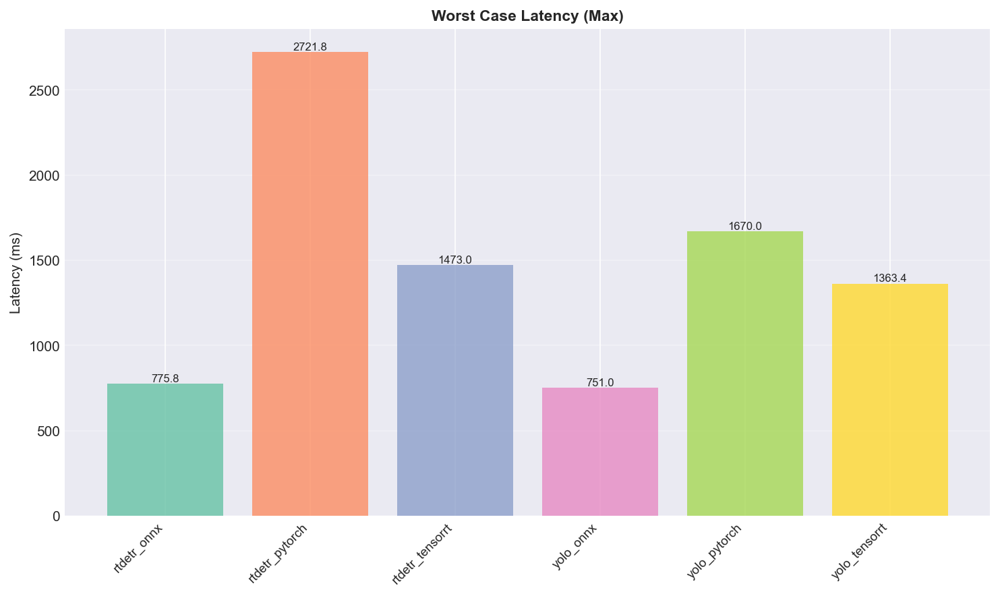
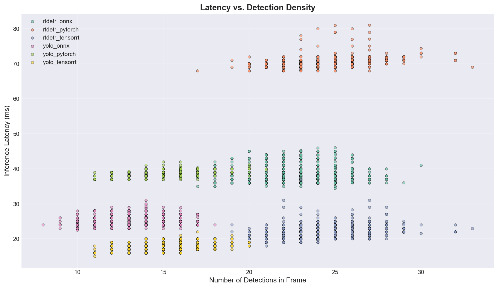

# 🔬 YOLO vs RT-DETR: Comprehensive Benchmark
### Real-time Object Detection Performance Analysis on NVIDIA GPU
---

## 📊 Research Overview

This project presents a **comprehensive empirical study** comparing two state-of-the-art object detection architectures:
- **YOLOv8** (You Only Look Once v8) - anchor-free, single-stage detector
- **RT-DETR** (Real-Time Detection Transformer) - transformer-based detector

I benchmark these models across **three inference backends** (PyTorch, ONNX Runtime, TensorRT) to evaluate real-world deployment performance on consumer-grade NVIDIA GPUs.

### 🎯 Research Questions

1. **How do YOLO and RT-DETR compare in terms of latency and throughput?**
2. **What is the performance impact of different inference backends?**
3. **Which architecture provides the best speed-accuracy trade-off for production deployment?**

---

## 🚀 Key Findings

### Performance Summary

| Model | Backend | Avg Latency (ms) | Avg FPS | P95 Latency (ms) | Detections/Frame |
|-------|---------|------------------|---------|------------------|------------------|
| **YOLO** | TensorRT | **19.67** | **50.84** | 19.99 | 15.11 |
| **RT-DETR** | TensorRT | **24.15** | **41.40** | 25.00 | 24.48 |
| **YOLO** | ONNX Runtime | 26.04 | 38.40 | 28.00 | 13.09 |
| **YOLO** | PyTorch | 40.90 | 24.45 | 40.00 | 15.12 |
| **RT-DETR** | ONNX Runtime | 39.35 | 25.41 | 43.96 | 23.05 |
| **RT-DETR** | PyTorch | 74.25 | 13.47 | 72.03 | 24.48 |

### 🔑 Main Insights

1. **YOLO + TensorRT** achieves the **fastest inference** (19.67 ms, 50.84 FPS), significantly outperforming other configurations.
2. **RT-DETR detects ~62% more objects** per frame (24.48 vs 15.11 avg detections) compared to YOLOv8.
3. **Backend optimization is critical**: TensorRT provides a **3.07x speedup** for RT-DETR and **2.08x speedup** for YOLO over native PyTorch.
4. **ONNX Runtime** offers a solid middle ground, providing significant speedups over PyTorch without the complexity of engine compilation.

---

## 🏗️ Architecture Comparison

### YOLOv8 (Anchor-Free CNN)


- **Strengths**: Ultra-low latency, simple architecture, mature ecosystem.
- **Trade-offs**: Fewer detections per frame, may miss small/occluded objects compared to Transformer-based models.

### RT-DETR (Transformer-Based)


- **Strengths**: Higher recall, better detection density, transformer attention mechanisms.
- **Trade-offs**: Higher computational cost, more memory intensive, benefits greatly from TensorRT optimization.

---

## 📈 Detailed Results


### Summary Comparsion


*A comprehensive overview of average latency, FPS, standard deviation, and total detections across all models and backends*

### Latency Over Time


*Time-series analysis reveals stable frame-to-frame performance after the initial warmup phase*

### FPS Over Time


### Latency Distribution


*Outliers removed via IQR method for visualization clarity*

### Worst Case Latency



*Warmup phase*

### Percentile Comparison


*Detailed percentile analysis (P50, P95, P99) highlights tail latency behavior*

### Detection Count Over Time


*RT-DETR maintains higher and more consistent detection counts in crowded scenes compared to YOLO*

### Latency vs. Detection Density



*Scatter plot showing how inference latency correlates with the number of objects detected in a frame*

---

## 🛠️ Experimental Setup

### Hardware Configuration
- **GPU**: NVIDIA GeForce RTX 5080
- **CPU**: Intel Xeon E5-2680 v4 @ 2.4GHz
- **RAM**: 32GB RAM DDR4
- **Driver**: CUDA 13.1, cuDNN 8.9.6

### Software Stack
- **Framework**: PyTorch 2.11+cu130 (dev), Ultralytics 8.4.5
- **Backends**: 
  - PyTorch (native JIT)
  - ONNX Runtime 1.24.0 ([custom for blackwell support](https://huggingface.co/ussoewwin/onnxruntime-gpu-1.24.0))(CUDAExecutionProvider)
  - TensorRT 10.9.0.34
- **OS**: Windows 10 x64
- **Python**: 3.12

### Dataset & Methodology
- **Video**: 705 frames @ 1080p (crowd surveillance scenario)
- **Metrics**: Frame-level latency, FPS, detection count
- **Warm-up**: First 5 frames excluded from metrics
- **Precision**: FP32 inference

---

## 📂 Project Structure

```
crowd-detection/
├── data/                       # Input videos
│   └── test_video.mp4
├── src/
│   ├── detectors/              # Model implementations
|   │   ├── factory.py
│   │   ├── yolo_detector.py
│   │   ├── rtdetr_detector.py
│   │   ├── onnx_detector.py
│   │   └── trt_detector.py
│   ├── utils/
│   │   ├── cli.py              # CLI argument parsing
│   │   ├── model_manager.py    # Automated model downloading/exporting
│   │   ├── metrics.py          # Performance tracking
│   │   └── video_processor.py
│   └── export/
│       └── model_exporter.py   # ONNX/TRT conversion
├── metrics/                    # JSON metrics (6 runs)
│   ├── yolo_pytorch_metrics.json
│   ├── yolo_onnx_metrics.json
│   ├── yolo_tensorrt_metrics.json
│   ├── rtdetr_pytorch_metrics.json
│   ├── rtdetr_onnx_metrics.json
│   └── rtdetr_tensorrt_metrics.json
├── plots/
│   ├── summary_comparison.png
│   ├── latency_over_time.png
│   ├── fps_over_time.png
│   ├── latency_distribution.png
│   ├── percentile_comparison.png
│   └── detections_over_time.png
├── output/                     # Processed videos
├── main.py                     # CLI entry point
├── visualize_metrics.py        # Plotting utilities
├── config.yaml                 # Model configurations
├── requirements.txt
├── Dockerfile
└── docker-compose.yml
```

---

## 🚀 Quick Start

### Local Installation

```bash
# Clone repository
git clone https://github.com/Shazy021/yolo-vs-rtdetr-benchmark.git

cd yolo-vs-rtdetr-benchmark

# Create virtual environment
python -m venv .venv
source .venv/bin/activate  # Windows: .venv\Scripts\activate

# Install dependencies
pip install -r requirements.txt

# Run benchmark
python main.py --source data/crowd.mp4 --model yolo --backend onnx --output outputs/yolo_onnx.mp4 --save-metrics metrics/yolo_onnx.json
```

### Docker Deployment

```bash
docker-compose build crowd-detection

# Run ONNX benchmark
docker-compose run --rm crowd-detection \
    --source data/crowd.mp4 \
    --model yolo \
    --backend onnx \
    --output outputs/yolo_onnx.mp4 \
    --save-metrics metrics/yolo_onnx.json

# Generate visualizations
python visualize_metrics.py --glob "metrics/*.json" --skip-warmup 5

```
## 💻 CLI Usage

### Basic Usage

```bash
python main.py --source VIDEO --model MODEL --backend BACKEND [OPTIONS]
```

### Arguments

| Flag | Type | Default | Description |
|------|------|---------|-------------|
| `--source` | `str` | **required** | Path to input video file |
| `--output` | `str` | `output/result.mp4` | Path to output video |
| `--config` | `str` | `config.yaml` | Path to config file |
| `--model` | `yolo\|rtdetr` | from config | Model architecture |
| `--backend` | `pytorch\|onnx\|tensorrt` | from config | Inference backend |
| `--weights` | `str` | from config | Path to model weights |
| `--conf` | `float` | from config | Confidence threshold |
| `--nms` | `float` | from config | NMS threshold |
| `--max-frames` | `int` | all | Maximum frames to process |
| `--show` | `flag` | - | Show preview window |
| `--no-display-info` | `flag` | - | Hide FPS overlay |
| `--save-metrics` | `str` | - | Save metrics to JSON |
| `--no-metrics` | `flag` | - | Disable metrics tracking |
| `--comparison-mode` | `fair\|adaptive` | from config | Input size strategy |
### Examples


---

## 📊 Reproducing the Benchmark

### Step 1: Run All Benchmarks

```bash
# YOLO variants
python main.py --source data/crowd.mp4 --model yolo --backend pytorch --save-metrics metrics/yolo_pytorch.json
python main.py --source data/crowd.mp4 --model yolo --backend onnx --save-metrics metrics/yolo_onnx.json
python main.py --source data/crowd.mp4 --model yolo --backend tensorrt --save-metrics metrics/yolo_tensorrt.json

# RT-DETR variants
python main.py --source data/crowd.mp4 --model rtdetr --backend pytorch --save-metrics metrics/rtdetr_pytorch.json
python main.py --source data/crowd.mp4 --model rtdetr --backend onnx --save-metrics metrics/rtdetr_onnx.json
python main.py --source data/crowd.mp4 --model rtdetr --backend tensorrt --save-metrics metrics/rtdetr_tensorrt.json
```

### Step 2: Generate Visualizations

```bash
python visualize_metrics.py \
    --glob "metrics/*.json" \
    --skip-warmup 5 \
    --output plots/
```

---

## 🎥 Demo Results

| Config | Latency | FPS | Demo |
|--------|---------|-----|------|
| **YOLO TensorRT** | 19.67ms | 50.84 |  |
| **YOLO ONNX** | 26.04ms | 38.40 |  |
| **YOLO PyTorch** | 40.90ms | 24.45 |  | Native framework |
| **RT-DETR TensorRT** | 24.15ms | 41.40 | |
| **RT-DETR ONNX** | 39.35ms | 25.41 |  |
| **RT-DETR PyTorch** | 74.25ms | 13.47 |  |


---

## 🔍 Analysis & Discussion

### Backend Optimization Impact

**TensorRT Speedup:**
- YOLOv8: **2.08x faster** than PyTorch (40.90ms → 19.67ms).
- RT-DETR: **3.07x faster** than PyTorch (74.25ms → 24.15ms).

**ONNX Runtime Speedup:**
- YOLOv8: **1.57x faster** than PyTorch (40.90ms → 26.04ms).
- RT-DETR: **1.89x faster** than PyTorch (74.25ms → 39.35ms).

**Stability:**
- ONNX Runtime shows significantly lower standard deviation compared to native PyTorch execution, resulting in smoother real-time performance.

### Detection Quality Trade-offs

RT-DETR achieves **~62% more detections** than YOLOv8 (24.48 vs 15.11 avg detections):
- Better recall for crowded scenes.
- Transformer attention captures spatial relationships.
- Cost: Higher base latency, though significantly optimized by TensorRT.

### Production Deployment Recommendations

| Use Case | Recommended Configuration | Rationale |
|----------|--------------------------|-----------|
| **low latency Edge** | YOLOv8 + TensorRT | Lowest latency (19.67ms), highest FPS (50.84) |
| **High Recall / Crowded Scenes** | RT-DETR + TensorRT | Balanced speed (24.15ms) + detection density (24.48/frame) |
| **CPU / General Deployment** | YOLOv8 + ONNX | Significant speedup over PyTorch without specialized GPU engine |
| **Research / Prototyping** | PyTorch (Native) | Easiest to debug and modify models |


---

<p align="center">
  <sub>for computer vision community</sub>
</p>